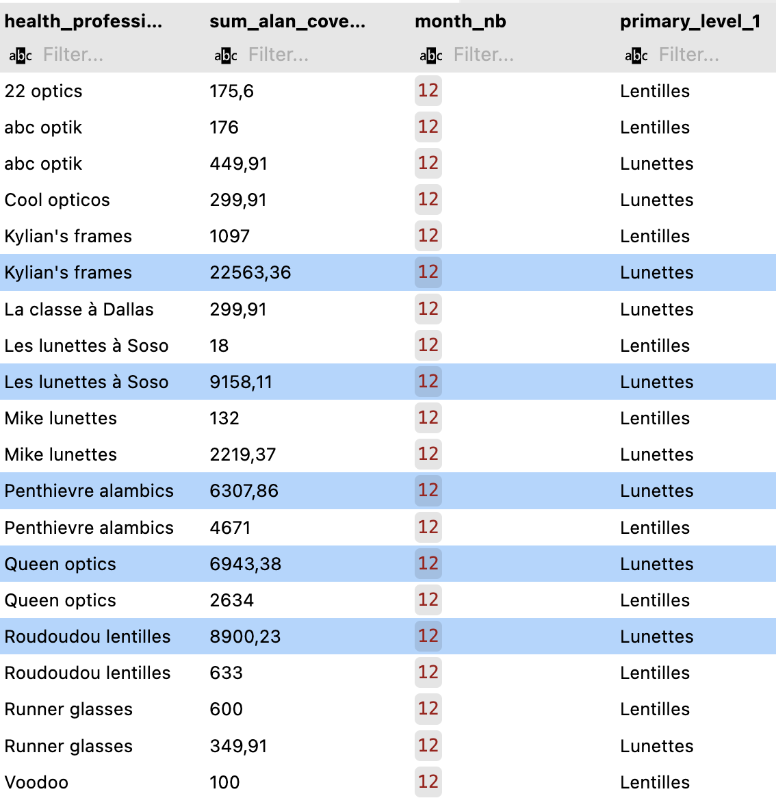
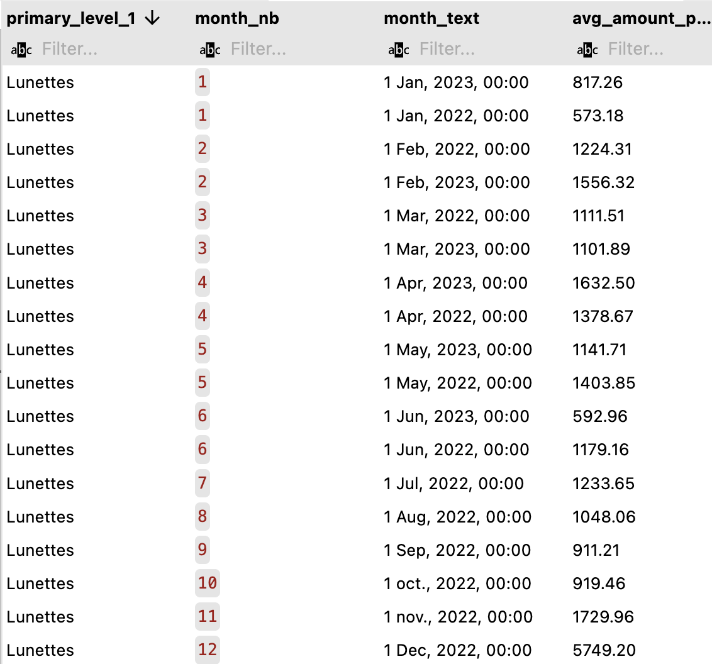
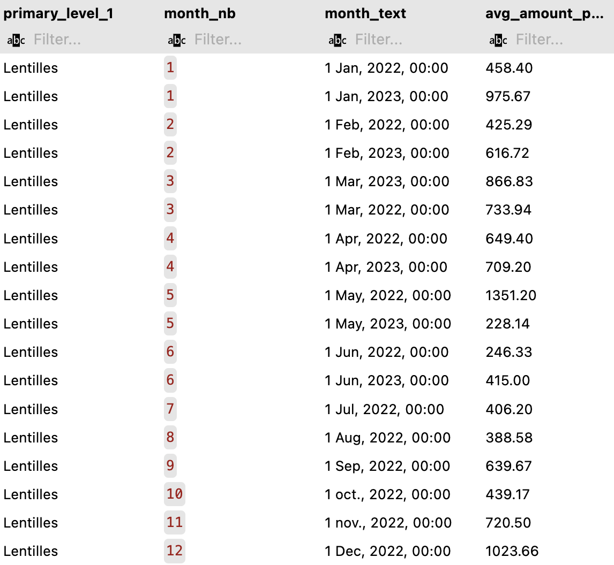
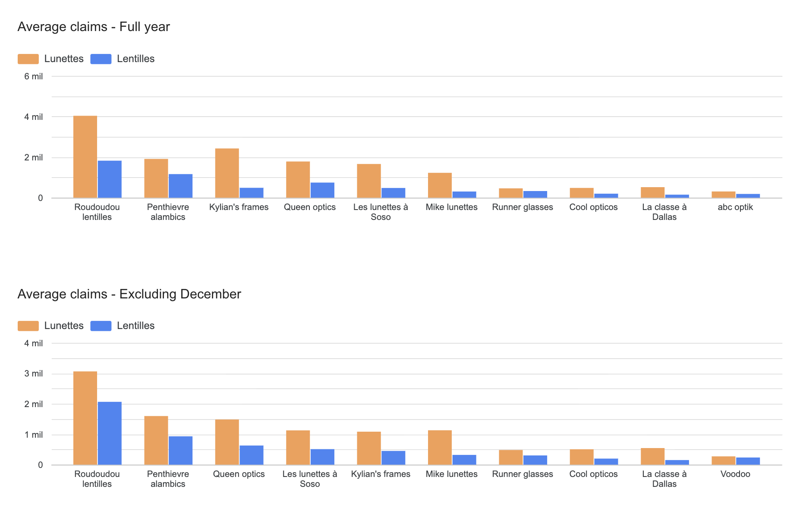

## Are there any patterns in the data that could indicate fraudulent activity for health professionals? Have you identified one or several suspicious health professionals? 

Toward the end of the year, there appears to be a spike in claims, particularly for lunettes.

#### Probable causes

1. Annual optical allowances: one possible explanation is end-of-year benefit exhaustion, since mutuelles often include annual allowances for optical care. Because these limits reset at the beginning of the year, members may purchase glasses before the reset to use their remaining coverage, which can cause a spike in demand in November–December.

2. Billing delays: claims may not be filed in the month when the treatment occurred and instead may be accumulated and submitted in December. While this may not immediately suggest fraud, it could still be considered irregular behavior if it does not comply with the proper procedures defined in the terms and conditions.

4. Mismatch between invoices and treatment dates: invoices may not correspond to the actual treatment dates, meaning claims could be backdated or dates may have been manipulated.

These explanations do not necessarily indicate fraud. However, the magnitude of certain reimbursements appears unusually high compared to other providers. Kylian's frames, Les lunettes à Soso, and Roudoudou lentilles show significantly larger claim amounts than other professionals.

*Kylian's frames, Les lunettes à Soso, Penthievre alambics, Queen optics and Roudoudou lentilles show significantly high claims compared to other professionals.*

*Lunettes average amount seems consistent throughout the year but December; showing a spike of 5729,20€ in reimbursement amount.*

*Lentilles show a consistent yearly pattern, with spikes in May and December. The December increase can be explained by benefit exhaustion. However, the May amount is also high and could be worth investigating further to understand the possible causes of this spike.*

## How would you identify if this trend could be related to fraud? What methods would you consider to investigate and potentially recover any misappropriated funds?

### Analysis
- Does this spike happen every year?
    No enough data to review past december 2021 to december 2022.
- Does it affect all professionals or only a few?
    Only a few professionals show a significant spike in December compared to others. It could be because they're larger clinics so that's why I compared high-spike professionals avg in december to their avg in the year. Results show their average is off by more than 500€. 
- Is the spike concentrated in a specific product type? 
    Spike is concentrated in lunettes. Even though there's a slight spike in December for lentilles, it's smaller and could be explain by end of the year benefit exhaustion. 
- Is there a big spike in average from the rest of the months compared to December? There is indeed a big gap in average when factoring in December. 

*Bar graph visualizes average gaps in claims to further analyze December's influence in average yearly average. This graph have been generated using Looker Studio*.

### Key findings
Comparing average gaps
- Kylian's frames average from January to November is 1084,68€. Factoring December in, the average spikes to 2427,09€. Showing a gap in average of: 1342,41€
- Roudoudou lentilles average from January to November is 3061,70€. Factoring December in, the average spikes to 4034,79€. Showing a gap in average of: 973,09€
- Les lunettes á Soso average from January to November is 1127,16€. Factoring December in, the average spikes to 1662,56€. Showing a gap in average of: 535,40€

While other professionals' gaps in average are less than 500€. 

Additionally, claims made by these professionals in December are significantly higher than their yearly average. 
- Kylian's frames: 22563,36€
- Roudoudou lentilles: 8900,23€
- Les lunettes á Soso: 9158,11€

While Penthievre alambics (6307,86€) and Queen optics (6943,38€) claims are also high, their gap in average is less than 500€.  

### What methods would you consider to investigate and potentially recover any misappropriated funds?

Investigation steps:
1. Verify treatment date vs claim submission date: check whether services were actually provided in December
2. Glasses being billed with lenses when patients only purchased the glasses. Check whether providers frequently claim lenses and glasses together with unusually high reimbursement amounts
3. Patient analysis: are there multiple claims for the same patient in a short time? 
4. Claims audit: verify invoices submitted by the provider, check prescription validity, are prices consistent with market prices? 
5. Contact the patient to confirm treatment

If fraud is confirmed: 
1. Suspend reimbursements temporarily
2. Require pre-validation for future claims
3. Reimbursement clawbacks 

Ultimately, there can also be legal consequences such as:
1. Terminate provider contract. 

## Based on your analysis, what proactive actions would you take or initiate to prevent similar fraud in the future?

#### 1. Automated monitoring and anomaly detection

Implement an automated dashboard to monitor claims patterns and detect anomalies in real time. This dashboard could flag unusual spikes in reimbursements, particularly during high-risk periods such as December.

Examples of automated rules can be:
- Flagging claims significantly higher than a provider’s historical average.
- Detecting unusual seasonal spikes compared to past trends.
- Benchmarking providers against similar clinics to identify outliers.
- Flagging repeated glasses + lenses claims for the same member with high reimbursement amount.

These alerts could be triggered before reimbursement is processed, allowing the fraud team to review suspicious claims before payout. 

#### 2. Mandatory documentation for high-value claims

Claims that exceed the professional's typical average (e.g., €1000–€3000 depending on the category) should require supporting documentation such as:
- Treatment date (to compare with the claim submission date)
- Valid prescription
- Original invoice

If a high-value claim is submitted, the system could automatically trigger a fraud review notification. Having documentation attached in advance would help the team investigate cases more efficiently.

#### 3. Provider risk scoring

Introduce a provider risk score based on historical claim behavior. Risk indicators could include:

- High reimbursement amounts
- Large monthly fluctuations
- Frequent high-value claims
- Claims that deviate significantly from other professionals' averages

Providers with higher risk scores could be subject to additional reviews, pre-authorization requirements, or audits.

#### 4. Collaboration with data teams

Work closely with data engineers and analysts to identify additional data that could improve fraud detection. Better data availability would help build more effective monitoring dashboards and anomaly detection systems.

## Limitations

Missing data for full year comparison. 